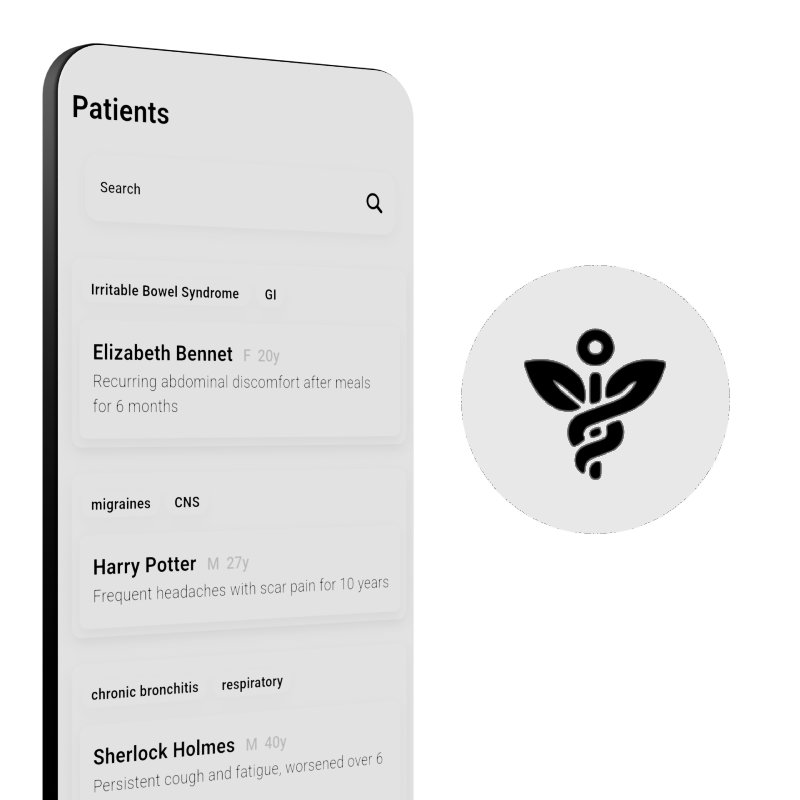
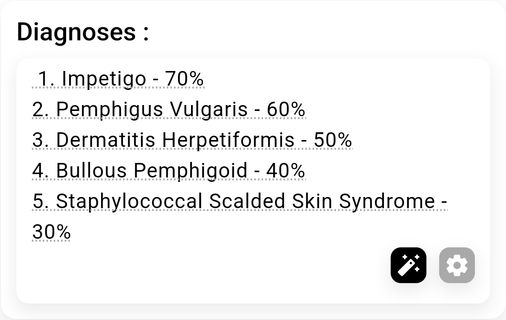

# **Sage - Your AI-Powered Medical Assistant**

Sage is an AI-powered app designed to assist medical students in taking comprehensive and structured patient histories. It provides guided questions, organizes data efficiently, and helps streamline the clinical assessment process.

## How to get the app?

Download the apk from releases or clone and build it yourself using Flutter.

This app was developed and tested on Android. However, since it’s built with Flutter, it can be easily cloned and deployed on other platforms.

## Features

- Generate
    - Diagnoses
    - Suggested questions
    - Suggested treatment

- AI-Refactoring
    - History
    - Examinations

- A completely open source
- Nice UI

## Requirements

- Google Gemini API key

OR

- OPENAI(ChatGPT) API key

## Visit for more information:-

https://bytesizeben.com/